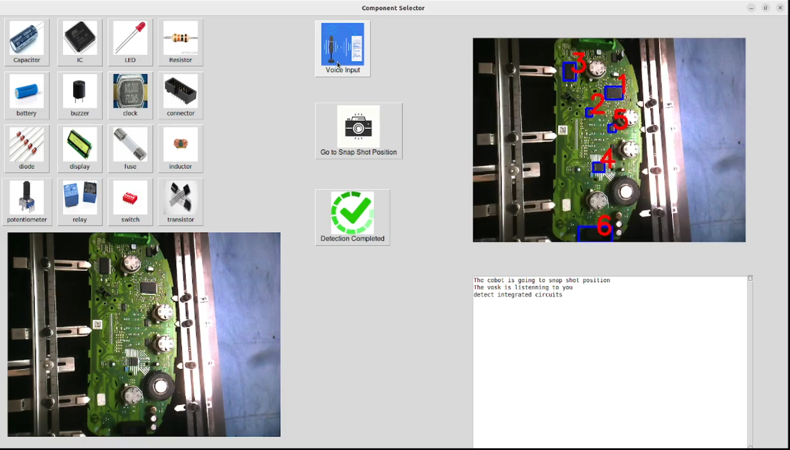

# Intuitive AI-Enabled Human Robot Collaboration in desoldering of printed circuit boards (PCBs) considering the operator's safety  


In the experiment, a collaborative robot (UR5e) has been equipted with a hot gun (desoldering tool), the cobot heats up the components and an operator removes the desoldered components. The setup consists of two modules: (i)  AI-Enabled graphical user interface(GUI) which enables the operator to select the type of components he/she wants to desolder through a vocal command and the LLMs interperation or a direct select with a 'Button' on the GUI, (ii) Safety module which monitors the distance of the desoldering tool with respect to operator's hand knuckls. Below you can find more elaboration on each modules:


### AI-Based GUI

Initially, the operator clicks on the button "Go to Snap Shot Position", making the robot move to a predefined configuration to take a snap shot from the PCB. In the next step, the operator should determine the kind of component he/she wants to be desoldered by clicking on the grid of button at top left or by clicking the "Voice Input" button to select the kind vocally. Afterwards, the snap shot and kind of component will be forwareded to the Object detection model (YOLOv8 model) and the result will be shown on the top right. If the operator is satisfied with the result of detection, he will click on the "Detection Completed" button. (The image on the bottom left showes the live stream of camera).
<p align="center">
  </a>
</p>

### Safey module
 It is assumed that a minimum distance between the desoldering tool and the operator's hand must be maintained to ensure the safety of operator.Hence the tool position is being tacked using Aruco marker and the operator's hand kuckles will be localized through [MediaPipe Hand landmarker task of google](https://ai.google.dev/edge/mediapipe/solutions/vision/hand_landmarker). 
<p align="center">
  </a>
</p>

#### How to run ?
```bash
export ROS_DOMAIN_ID=1
ros2 launch ur_robot_driver ur_control.launch.py ur_type:=ur5e robot_ip:=192.168.0.100 launch_rviz:=false
```
```bash
export ROS_DOMAIN_ID=1
ros2 launch ur_moveit_config ur_moveit.launch.py ur_type:="ur5e" launch_rviz:=false
```
```bash

export ROS_DOMAIN_ID=1
ros2 run safety_check gui
```
```bash

export ROS_DOMAIN_ID=1
ros2 run safety_check handlandmark
```
```bash

export ROS_DOMAIN_ID=1
ros2 run safety_check wrist_camera_publisher
```
```bash

export ROS_DOMAIN_ID=1
ros2 run safety_check component_detection_server
```
```bash

export ROS_DOMAIN_ID=1
ros2 run safety_check component_selection_client 
```

```bash

export ROS_DOMAIN_ID=1
ros2 launch ur5e_move heat_logic.launch.py ur_type:="ur5e"
```
```bash

ros2 launch ur5e_move automatic_desoldering.launch.py ur_type:="ur5e"
```
```bash

ros2 topic pub --once /com_id custom_interfaces/msg/Llmfeedback "{number_id: 3, type: 'ComponentCounter'}"

ros2 topic pub --once /com_id custom_interfaces/msg/Llmfeedback "{number_id: 1, type: 'ComponentClass'}"
```